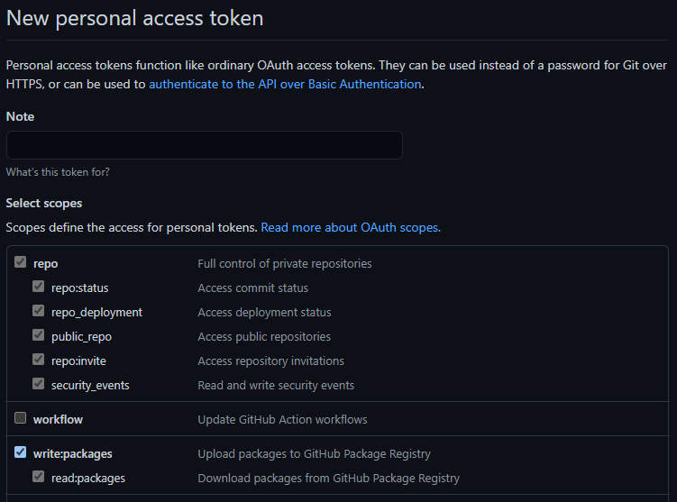

# React Mega Menu Demo

The following is a project to test and demo the
[@jasonrundell/react-mega-menu](https://github.com/jasonrundell/react-mega-menu)
library. Please visit to learn more about this library's features.

## Using the library

To use the `@jasonrundell/react-mega-menu` NPM package, you'll need to use the
GitHub package registry and create an `.npmrc` file.

1. Create an `.npmrc` file in the same directory as your project's
   `package.json`
2. Add the following lines of code yto your `.npmrc` file:

```bash
@jasonrundell:registry=https://npm.pkg.github.com
//npm.pkg.github.com/:_authToken={YOUR_GITHUB_PERSONAL_ACCESS_TOKEN}
```

3. Replace `GITHUB_PERSONAL_ACCESS_TOKEN` with the value of a GitHub token
   [https://github.com/settings/tokens](https://github.com/settings/tokens).
   Generate a new token, and grant it the following scopes:



## View demo

Visit:
[https://react-mega-menu-demo.vercel.app](https://react-mega-menu-demo.vercel.app)

## Deploy

### Vercel

[](https://vercel.com/new/project?template=https://github.com/jasonrundell/react-mega-menu-demo)